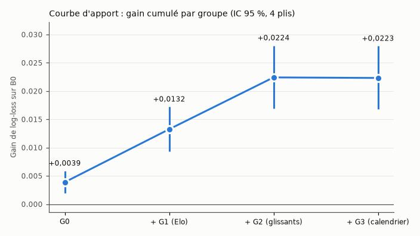

# Ablations : que rapporte chaque information ? (jalon J6, lot 3)

*Sous-étape 4.12, 2026-09-30. Structure : M3, Poisson par équipe (ADR-0038). Protocole figé (ADR-0037, tag `protocole-v1`), 4 plis, 7 156 matchs du top 5, aucun match écarté par l'intersection. Rapports : `reports/experiments/ablations-20260930T110352.json` (groupes), `reports/experiments/population-20260930T120945.json` (population). Essais à cette date : **9**, 0 échec.*

## Courbe d'apport

Ajout cumulatif des groupes au modèle de Poisson par équipe, population d'apprentissage « top 5 » ; demi-vie de G2 choisie dans chaque pli par validation interne (240 jours dans 3 plis, 120 jours en 2022-23). Gain = log-loss de B0 moins log-loss du modèle (positif : mieux que B0) ; « apport de l'étape » = gain sur l'étape précédente, jugé par la règle de l'ADR-0037.

| Étape | Log-loss poolé | Gain cumulé sur B0 [IC 95 %] | Apport de l'étape [IC 95 %] | Plis où l'étape gagne | Retenu |
|---|---|---|---|---|---|
| G0 | 1.8990 | +0.0039 [+0.0019 ; +0.0059] | — | — | oui (sur B0) |
| + G1 (Elo) | 1.8897 | +0.0132 [+0.0093 ; +0.0172] | +0.0094 [+0.0060 ; +0.0128] | 4 sur 4 | oui |
| + G2 (glissants) | 1.8805 | +0.0224 [+0.0169 ; +0.0280] | +0.0092 [+0.0057 ; +0.0127] | 4 sur 4 | oui |
| + G3 (calendrier) | 1.8806 | +0.0223 [+0.0168 ; +0.0279] | -0.0001 [-0.0004 ; +0.0002] | 2 sur 4 | **non** |

**Réponse à « que rapporte chaque information ? »** (en nats par match, sur un log-loss d'environ 1,88) :

- **G0, le contexte** (terrain, championnat, huis clos) : +0,0039, le niveau de B1 (B0 − B1 : +0,0046).
- **G1, l'Elo** : +0,0094 de plus, le plus gros apport d'un seul groupe. Savoir qui est fort compte.
- **G2, les moyennes glissantes** de buts et d'`xg_proxy`, pour et contre : **+0,0092 de plus**, presque autant que l'Elo. L'Elo résume la force (qui gagne) ; les glissants disent **combien** une équipe marque et concède, ce qui est la question du total.
- **G3, le calendrier** (repos, matchs récents, coupe d'Europe) : −0,0001 [−0,0004 ; +0,0002] : **rien**. Il n'est pas retenu.
- Au total, le modèle retenu bat **B1 de +0,0179 [+0,0133 ; +0,0226]**, 4 plis sur 4 (objectif du MVP, ADR-0037), avec une pente de calibration poolée de 0,95 (dans [0,9 ; 1,1]).

## Population d'apprentissage (décision 6)

Même modèle (G0 + G1 + G2), appris sur le top 5 seul ou sur le top 5 et les D2, évalué sur le top 5 :

| A | B | Écart de log-loss A − B | IC 95 % | Plis où B gagne | Règle |
|---|---|---|---|---|---|
| top 5 | top 5 et D2 | +0,0003 | [−0,0003 ; +0,0010] | 3 sur 4 | (i) non : **top 5 retenu** |

Les D2 doublent presque les lignes d'apprentissage (67 856 contre 32 492 dans le dernier pli), dont 2 250 à 2 300 sont exclues (`xg_proxy` vide), et le gain n'est pas significatif : on garde le plus simple.

## Modèle retenu par les ablations

**M3, Poisson par équipe, variables G0 + G1 + G2, demi-vie choisie par validation interne, appris sur le top 5.** G3 n'étant pas retenu, **le même modèle sert en rejeu et en live** (ADR-0011, règle 4) : il n'y a pas de variante « sans G3 » à sélectionner. C'est l'entrée de la sous-étape 4.13 (choix du modèle H1).

## Analyses complémentaires (descriptives, jamais pour sélectionner)

Intervalles par bootstrap par blocs de journées ; ils ne comptent pas dans la règle.

Apport de G2 (A1 − A2), par tranche de journées :

| Groupe | Matchs | Gain moyen | IC 95 % |
|---|---|---|---|
| 1-5 | 970 | +0.0095 | [-0.0007 ; +0.0195] |
| 6-10 | 970 | +0.0033 | [-0.0071 ; +0.0132] |
| 11-19 | 1746 | +0.0073 | [+0.0006 ; +0.0138] |
| 20-99 | 3470 | +0.0117 | [+0.0067 ; +0.0167] |

Apport de G2 (A1 − A2), par championnat :

| Groupe | Matchs | Gain moyen | IC 95 % |
|---|---|---|---|
| Bundesliga | 1224 | +0.0084 | [+0.0012 ; +0.0155] |
| La Liga | 1520 | +0.0128 | [+0.0044 ; +0.0209] |
| Ligue 1, 18 clubs | 612 | +0.0081 | [-0.0057 ; +0.0221] |
| Ligue 1, 20 clubs | 760 | +0.0048 | [-0.0053 ; +0.0153] |
| Premier League | 1520 | +0.0081 | [-0.0005 ; +0.0164] |
| Serie A | 1520 | +0.0098 | [+0.0031 ; +0.0168] |

Modèle retenu contre B1 (B1 − A2), par tranche de journées :

| Groupe | Matchs | Gain moyen | IC 95 % |
|---|---|---|---|
| 1-5 | 970 | +0.0243 | [+0.0117 ; +0.0371] |
| 6-10 | 970 | +0.0073 | [-0.0047 ; +0.0195] |
| 11-19 | 1746 | +0.0111 | [+0.0027 ; +0.0196] |
| 20-99 | 3470 | +0.0224 | [+0.0155 ; +0.0292] |

Modèle retenu contre B1 (B1 − A2), par championnat :

| Groupe | Matchs | Gain moyen | IC 95 % |
|---|---|---|---|
| Bundesliga | 1224 | +0.0202 | [+0.0090 ; +0.0317] |
| La Liga | 1520 | +0.0233 | [+0.0125 ; +0.0340] |
| Ligue 1, 18 clubs | 612 | +0.0188 | [+0.0023 ; +0.0359] |
| Ligue 1, 20 clubs | 760 | +0.0142 | [+0.0020 ; +0.0266] |
| Premier League | 1520 | +0.0166 | [+0.0070 ; +0.0263] |
| Serie A | 1520 | +0.0133 | [+0.0037 ; +0.0228] |

| Pli | Domicile | Domicile × huis clos [IC 95 %] | Rapport domicile/extérieur, public | À huis clos |
|---|---|---|---|---|
| 2021-22 | +0.266 | -0.164 [-0.221 ; -0.106] | 1.31 | 1.11 |
| 2022-23 | +0.258 | -0.154 [-0.211 ; -0.098] | 1.29 | 1.11 |
| 2023-24 | +0.256 | -0.153 [-0.210 ; -0.097] | 1.29 | 1.11 |
| 2024-25 | +0.250 | -0.148 [-0.203 ; -0.092] | 1.28 | 1.11 |

**Lecture** :

- **Début de saison** (rapport H.4) : l'apport de G2 n'est pas plus faible sur les journées 1 à 5 (+0,0095) qu'ailleurs : les glissants sans remise à zéro gardent l'information de la saison précédente, comme voulu (ADR-0032). Le modèle retenu bat B1 nettement en début de saison (+0,0243 sur les journées 1 à 5). Les journées 6 à 10 sont les moins bien servies, sans écart significatif entre tranches.
- **Ligue 1 à 18 clubs** (2023-24 et 2024-25) : gain sur B1 de +0,0188, contre +0,0142 à 20 clubs ; intervalles larges et recouvrants : pas d'effet visible du changement de format.
- **Huis clos** : aucun match à huis clos dans les saisons de test ; l'effet se lit dans les coefficients estimés sur l'apprentissage de chaque pli, qui contient 2019-20 et 2020-21. Avec public, l'équipe à domicile marque environ 1,29 fois ce qu'elle marquerait à l'extérieur ; **à huis clos, 1,11 fois** : l'interaction vaut environ −0,15 [−0,21 ; −0,10], très stable d'un pli à l'autre. L'avantage du terrain perd environ 60 % de son effet sans public (rapport C.2).

## Limites

- Le choix des groupes est cumulatif, dans l'ordre fixé par l'ADR-0037 (G0, G1, G2, G3) : l'apport de G3 est mesuré **après** G2 ; seul, il pourrait capter un peu de ce que G2 contient.
- G3 repose sur les coupes chargées, fiables à partir de 2015-16 à 2018-19 selon le pays (ADR-0033) ; son absence d'apport ne dit rien d'un calendrier mieux mesuré.
- Les analyses par tranche et par championnat sont nombreuses : un intervalle qui exclut 0 dans l'une d'elles ne prouve rien seul.
